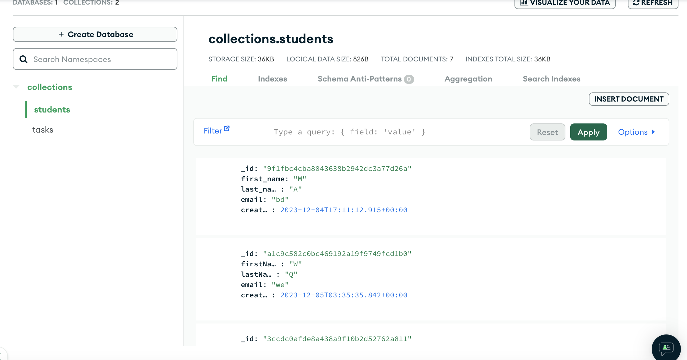
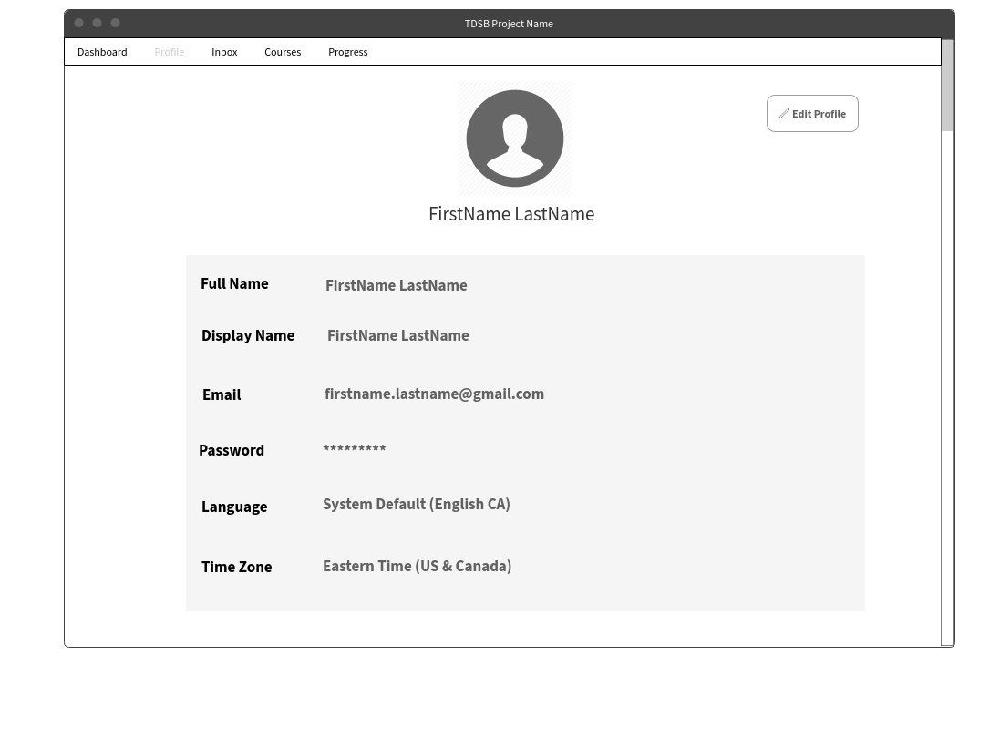
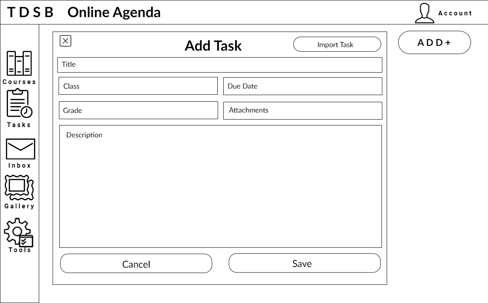

In this project I've used:

- MongoDB database to store students' info and the tasks asscociated with their student IDs.
  
- SQLAlchemy in Flask as a database to store users' authentication info
- React as front-end framework. I used SessionService and UserContext in React to design cookies/session stored in the local storage. This is not ideal since I'm managing sessions from the front-end, but prior to this I've tried using Flask session replicating CS50 Finance, however Flask and React don't mesh well for some reasons(?) and my flask sessions kept being wiped out everytime the page reloads.
- Python to manage back-end, responsible for interacting with databases.

Flow of databases and front-end interactions:

- When an user registers their data is added as an user to Flask SQL Alchemy, with an associacted ID generated by uuid modules, then their data is also added to MongoDB "students" collection.
- When an user logs in their credentials are checked if matched in the Flask SQLAlchemy database. Then this ID is stored in a storedUser object in thee local storage by SessionService in React. Every task the user submitted will be added to the MongoDB collection "tasks" and associated with their ID.
- When Calendar window is rendered the tasks in the current month will be retrieved from MongoDB "tasks" via the user's ID.
- In Profile window the user's data is displayed and so are the courses in which they're assigned tasks. These courses are retrieved from MongoDB "tasks" using the distinct command.

Front-end components design:

