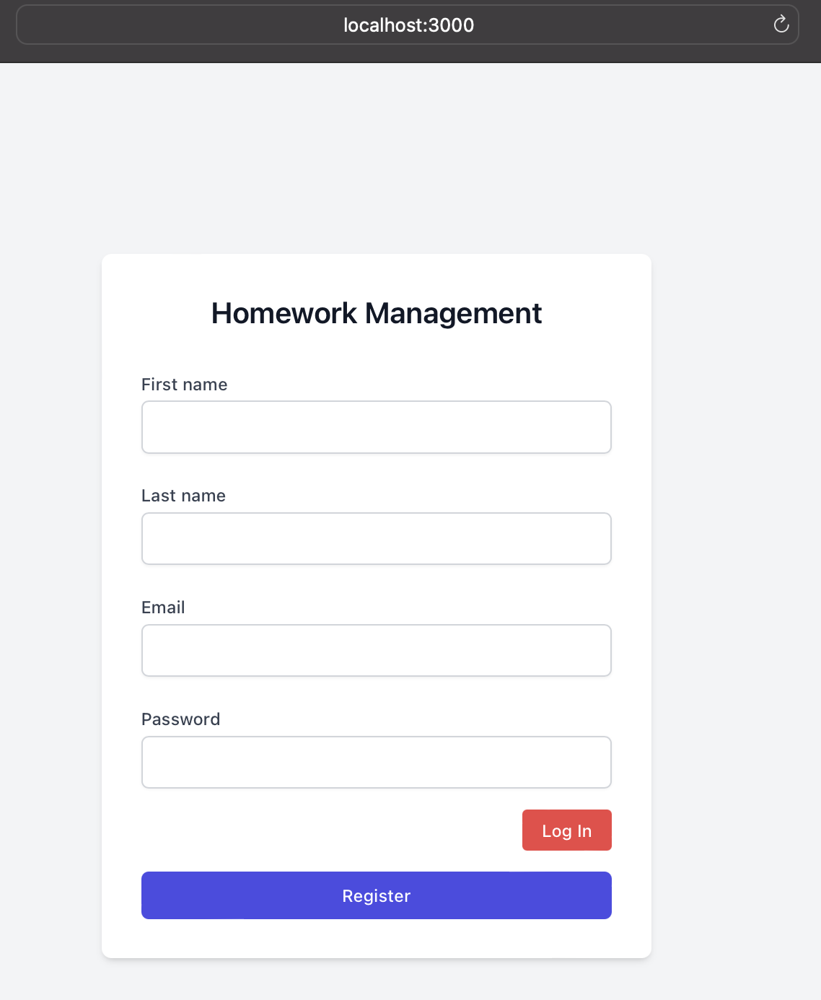
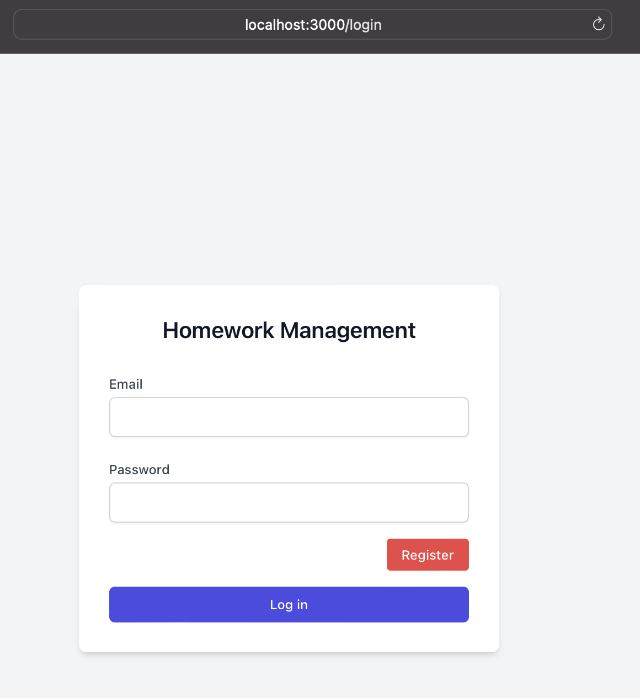
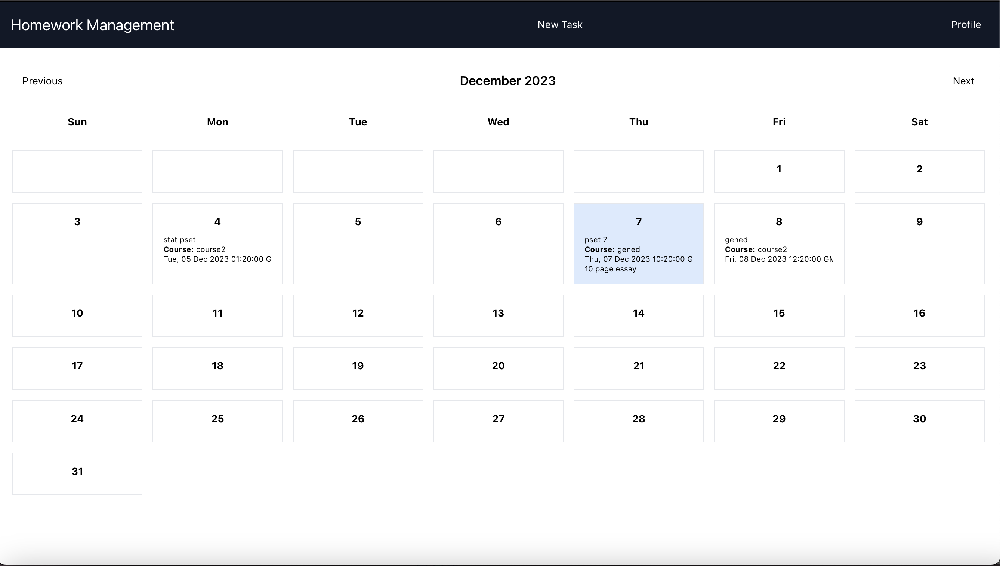
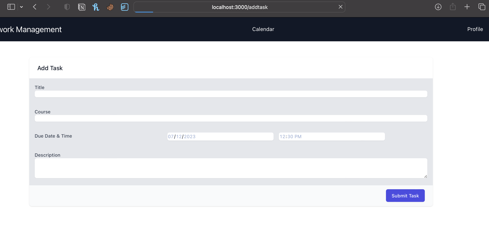
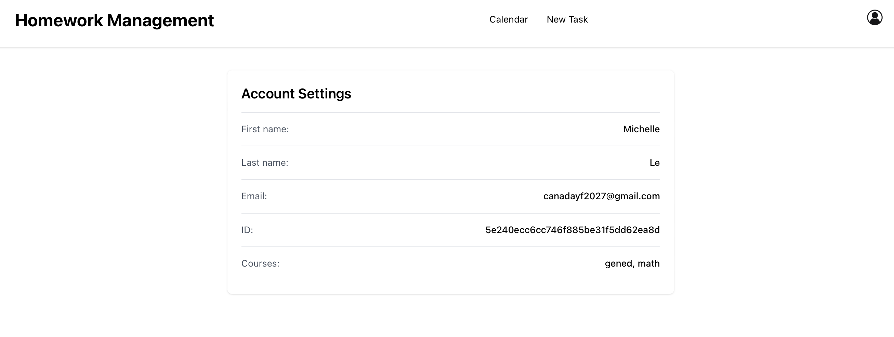

# Homework Management Website Guide

## Launch website locally

In the project directory, you can run:

### `npm install`

tp install the necessary dependencies

### `flask run`

Split terminal to boot up front end:

### `cd frontend`

Run:

### `npm install`

to install the necessary dependencies for front-end element

### `npm start`

You can register for a new account, log in, start adding tasks and see an overview of your tasks in calendar view and see the courses you are currently enrolled in:

Demonstration: https://youtu.be/3NHLLFHIazA

Regiter as new user:

If the email already exists, the website will return an error

Or log in instead if already registered for an account:

If logged in successfully, automatically redirects to calendar view:

You can add new task:

Go to profile to see the courses you are taking and personal information:

